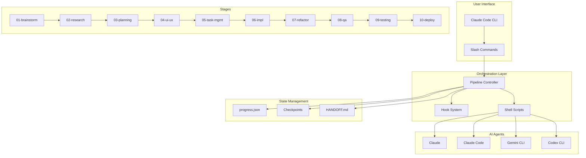
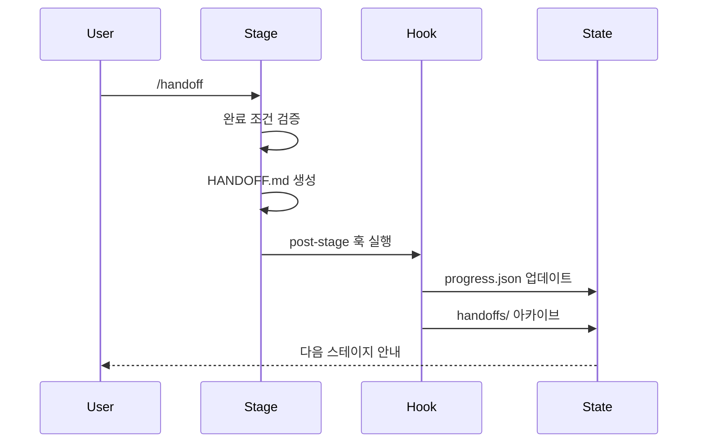
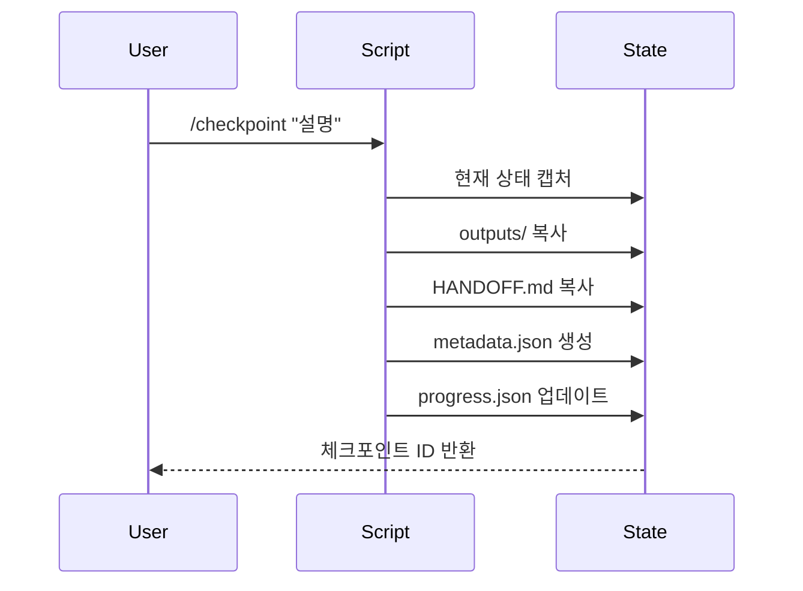

# Architecture

ax-templates 시스템 아키텍처 문서

## 시스템 개요



## 핵심 컴포넌트

### 1. Pipeline Controller

파이프라인의 전체 흐름을 관리합니다.

**책임:**
- 스테이지 순서 관리
- 전제조건 검증
- 상태 업데이트

**구현 파일:**
- `config/pipeline.yaml` - 파이프라인 정의
- `scripts/run-stage.sh` - 스테이지 실행

### 2. Hook System

스테이지 전/후 실행되는 훅을 관리합니다.

**책임:**
- 전제조건 검증 (pre-stage)
- 핸드오프 생성 알림 (post-stage)
- 상태 업데이트

**구현 파일:**
- `.claude/hooks/pre-stage.sh`
- `.claude/hooks/post-stage.sh`

### 3. State Management

파이프라인 상태를 외부 파일로 관리합니다.

**상태 파일:**
- `state/progress.json` - 전체 진행 상황
- `state/checkpoints/` - 체크포인트 스냅샷
- `state/handoffs/` - 핸드오프 아카이브

### 4. AI Agent Integration

멀티 AI 에이전트를 통합합니다.

**통합 방식:**
- Claude/ClaudeCode: 직접 실행
- Gemini/Codex: tmux 세션 기반 CLI 호출

**구현 파일:**
- `scripts/gemini-wrapper.sh`
- `scripts/codex-wrapper.sh`

## 데이터 흐름

### 1. 스테이지 간 데이터 전달

```
Stage N                    Stage N+1
├── outputs/          →    ├── inputs/
│   └── result.md          │   └── (참조)
└── HANDOFF.md        →    └── HANDOFF.md 참조
```

### 2. 핸드오프 프로세스



### 3. 체크포인트 프로세스



## 설정 계층

```
Global (CLAUDE.md, config/*.yaml)
    ↓
Stage (stages/XX/CLAUDE.md, config.yaml)
    ↓
Session (runtime state)
```

### 설정 우선순위
1. 스테이지 설정이 전역 설정을 오버라이드
2. 런타임 상태가 정적 설정을 오버라이드

## 확장 포인트

### 1. 새 스테이지 추가

```bash
mkdir -p stages/XX-new-stage/{prompts,templates,inputs,outputs}
```

필수 파일:
- `CLAUDE.md` - AI 지침
- `config.yaml` - 스테이지 설정
- `HANDOFF.md.template` - 핸드오프 템플릿

### 2. 새 AI 모델 추가

1. `config/models.yaml`에 모델 정의 추가
2. 필요시 래퍼 스크립트 작성 (`scripts/XXX-wrapper.sh`)
3. 슬래시 커맨드 추가 (`.claude/commands/XXX.md`)

### 3. 커스텀 훅 추가

`.claude/hooks/` 디렉토리에 스크립트 추가 후 `pipeline.yaml`에서 참조

## 보안 고려사항

1. **API 키**: 환경 변수로 관리 (절대 커밋 금지)
2. **샌드박스**: 구현/테스팅 스테이지는 샌드박스 모드
3. **체크포인트**: 민감 정보 제외 권장

## 성능 최적화

1. **컨텍스트 관리**: 퍼센트 기반 임계값 (60%/50%/40% 남은 컨텍스트 기준)
   - 60% 남음: 경고 배너 표시
   - 50% 남음: 자동 상태 저장, 압축 권장
   - 40% 남음: `/clear` 권고, 복구 HANDOFF 생성
2. **병렬 실행**: Orchestrator-Workers 패턴 활용
3. **캐싱**: MCP 서버 캐시 활용 (firecrawl, exa)
