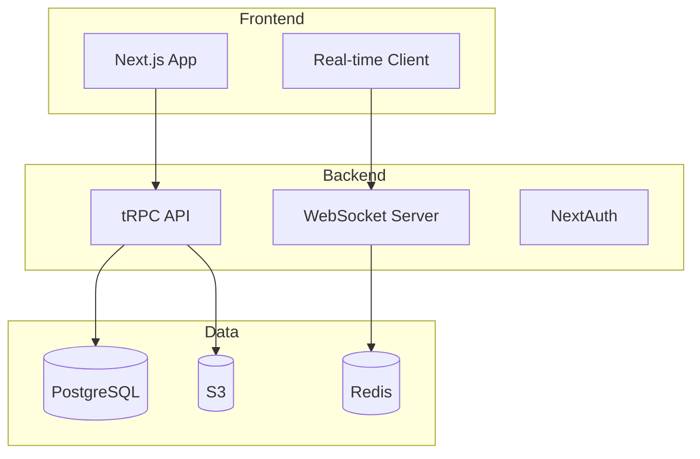

# Example: Complex SaaS

복잡한 SaaS 애플리케이션 개발 예제

## 프로젝트 개요

- **이름**: team-collab-platform
- **설명**: 팀 협업 플랫폼 (Notion + Slack 하이브리드)
- **기술 스택**: Next.js, TypeScript, PostgreSQL, Prisma, tRPC

## 복잡성 포인트

- 멀티테넌트 아키텍처
- 실시간 협업 (WebSocket)
- 사용자 인증/인가 (NextAuth)
- 결제 통합 (Stripe)
- 파일 업로드 (S3)

## 시작하기

### 1. 프로젝트 초기화

```bash
/init-project team-collab-platform
```

### 2. 프로젝트 브리프

`stages/01-brainstorm/inputs/project_brief.md`:

```markdown
# Project Brief

## 프로젝트 이름
team-collab-platform

## 한 줄 설명
실시간 문서 협업과 팀 커뮤니케이션을 통합한 올인원 플랫폼

## 문제 정의
- Notion은 커뮤니케이션 기능 부족
- Slack은 문서 관리 기능 부족
- 두 도구 간 컨텍스트 스위칭 비용

## 타겟 사용자
- 5-50인 규모 스타트업
- 원격/하이브리드 팀

## 핵심 기능
1. 블록 기반 문서 에디터
2. 실시간 채팅/스레드
3. 워크스페이스 관리
4. 파일 공유
5. 검색 통합

## 비기능적 요구사항
- 동시 사용자 100명 지원
- 99.9% 업타임
- GDPR 준수

## 제약조건
- 예산: 초기 인프라 월 $500 이내
- 일정: MVP 3개월
- 팀: 풀타임 개발자 2명
```

## 멀티 AI 활용 전략

### 브레인스토밍 (Stage 01)
```bash
/gemini "실시간 협업 도구의 최신 트렌드와 사용자 피드백을
ProductHunt, Reddit에서 조사해줘"
```

### 리서치 (Stage 02)
- Claude: 아키텍처 패턴 심층 분석
- MCP 서버: 기술 문서 검색

### 구현 (Stage 06)
- ClaudeCode: 핵심 기능 구현
- 체크포인트 필수!

### 리팩토링 (Stage 07)
```bash
/codex "WebSocket 연결 관리 코드를 분석하고
메모리 누수 가능성을 점검해줘"
```

## 예상 산출물

### 아키텍처


### 데이터 모델
- User, Workspace, Document, Block
- Channel, Message, Thread
- File, Permission

## 예상 소요 시간

| 스테이지 | 예상 시간 |
|----------|-----------|
| 01-brainstorm | 3시간 |
| 02-research | 4시간 |
| 03-planning | 3시간 |
| 04-ui-ux | 4시간 |
| 05-task-management | 2시간 |
| 06-implementation | 20시간 |
| 07-refactoring | 5시간 |
| 08-qa | 4시간 |
| 09-testing | 6시간 |
| 10-deployment | 3시간 |
| **총계** | **~54시간** |

## 체크포인트 전략

### 필수 체크포인트
1. 인증 시스템 완료 후
2. 실시간 기능 완료 후
3. 결제 연동 후

### 권장 체크포인트
- 각 스프린트 완료 시
- 주요 기능 완료 시

## 주의사항

- 06-implementation 스테이지는 여러 세션에 걸쳐 진행
- 컨텍스트 관리 철저히 (50k 토큰 경고 시 state.md 저장)
- 체크포인트 생성 필수
